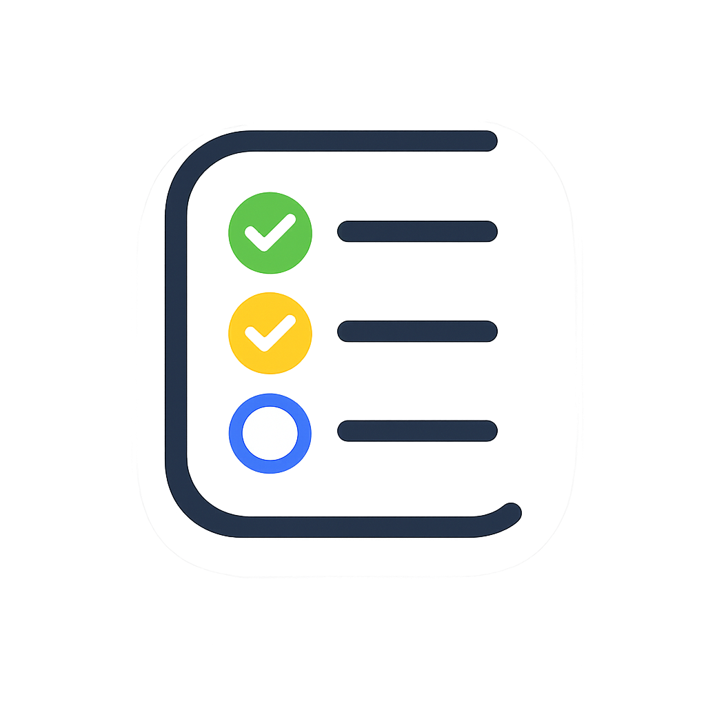

<p align="center">
  
</p>

<h1 align="center">Todolist — Full-Stack Task Management Application</h1>

<p align="center">
  A modern, full-stack task management application built with <strong>Angular 21</strong> and <strong>Node.js / Express</strong>, backed by <strong>MongoDB</strong>. Manage your daily tasks with ease — register, log in, and start organizing your workflow with priorities, categories, due dates, and more.
</p>

<p align="center">
  <a href="#-features">Features</a> •
  <a href="#-tech-stack">Tech Stack</a> •
  <a href="#-project-structure">Project Structure</a> •
  <a href="#-getting-started">Getting Started</a> •
  <a href="#-api-reference">API Reference</a> •
  <a href="#-deployment">Deployment</a> •
  <a href="#-contributing">Contributing</a> •
  <a href="#-license">License</a>
</p>

---

## ✨ Features

### Authentication & Security
- **User Registration & Login** — Secure account creation with email and password.
- **Password Hashing** — All passwords are hashed using `bcryptjs` before storage.
- **JWT-Based Authorization** — Stateless authentication with JSON Web Tokens (1-hour expiry).
- **Route Guards** — Protected client-side routes using Angular's `canActivate` guards.
- **Protected API Endpoints** — All task-related API routes require a valid Bearer token.

### Task Management & Productivity
- **Full CRUD Operations** — Create, read, update, and delete tasks seamlessly.
- **Subtasks (Checklists)** — Break down complex tasks into manageable sub-items.
- **Drag-and-Drop Reordering** — Take full control of task priority visually using Angular CDK.
- **Dashboard Analytics** — Real-time productivity banner displaying total, completed, pending counts, and completion percentage.
- **Pagination (Infinite Scroll)** — Efficiently loads tasks in batches of 10 with a "Load More" action for high performance.
- **Priority Levels & Categories** — Categorize tasks and assign `Low`, `Medium`, or `High` priority.
- **Status Tracking** — Toggle tasks between `Pending` and `Completed` states.
- **Inline Editing** — Edit task details and subtasks directly within the dashboard.
- **Search & Filtering** — Quickly find tasks using real-time search and status filters.

### User Experience
- **Dark / Light Theme Toggle** — Switch between dark and light modes on the fly.
- **Responsive Design** — Fully responsive layout with a mobile sidebar navigation.
- **User Profile Management** — View and update your profile (name and email) from the settings page.
- **Server-Side Rendering (SSR)** — Angular SSR support for improved performance and SEO.
- **Modern Typography** — Uses the [Space Grotesk](https://fonts.google.com/specimen/Space+Grotesk) font family.

---

## 🛠 Tech Stack

### Frontend
| Technology | Version | Purpose |
|---|---|---|
| [Angular](https://angular.dev/) | 21.x | Component-based SPA framework |
| [Angular CDK](https://material.angular.io/cdk/categories) | 21.x | Component Dev Kit (Drag & Drop) |
| [TypeScript](https://www.typescriptlang.org/) | 5.9 | Type-safe JavaScript superset |
| [RxJS](https://rxjs.dev/) | 7.8 | Reactive programming for HTTP & async flows |
| [Angular SSR](https://angular.dev/guide/ssr) | 21.x | Server-side rendering |
| [Vitest](https://vitest.dev/) | 4.x | Unit testing framework |

### Backend
| Technology | Version | Purpose |
|---|---|---|
| [Node.js](https://nodejs.org/) | — | JavaScript runtime |
| [Express](https://expressjs.com/) | 5.x | Minimal web framework for REST APIs |
| [MongoDB](https://www.mongodb.com/) | — | NoSQL document database |
| [Mongoose](https://mongoosejs.com/) | 9.x | MongoDB ODM for schema modeling |
| [JSON Web Tokens](https://jwt.io/) | 9.x | Stateless authentication tokens |
| [bcryptjs](https://github.com/dcodeIO/bcrypt.js) | 3.x | Password hashing |
| [Nodemon](https://nodemon.io/) | 3.x | Auto-restart during development |

### Deployment
| Platform | Purpose |
|---|---|
| [Vercel](https://vercel.com/) | Backend serverless deployment |
| [MongoDB Atlas](https://www.mongodb.com/atlas) | Cloud-hosted MongoDB |

---

## 📂 Project Structure

```
BCT_project/
├── backend/                    # Node.js / Express REST API
│   ├── config/
│   │   └── db.js               # MongoDB connection setup
│   ├── controllers/
│   │   ├── auth.controller.js  # Register, login, profile logic
│   │   └── task.controller.js  # CRUD operations for tasks
│   ├── middleware/
│   │   └── auth.middleware.js  # JWT verification middleware
│   ├── models/
│   │   ├── user.model.js       # Mongoose User schema
│   │   └── task.model.js       # Mongoose Task schema
│   ├── routes/
│   │   ├── auth.routes.js      # Authentication endpoints
│   │   └── task.routes.js      # Task management endpoints
│   ├── .env                    # Environment variables (not committed)
│   ├── .gitignore
│   ├── package.json
│   ├── server.js               # Express app entry point
│   └── vercel.json             # Vercel deployment configuration
│
├── todo/                       # Angular 21 frontend application
│   ├── src/
│   │   ├── app/
│   │   │   ├── about/          # About page component
│   │   │   ├── dashboard/      # Task dashboard (main feature)
│   │   │   ├── home/           # Landing / home page
│   │   │   ├── login/          # Login page component
│   │   │   ├── register/       # Registration page component
│   │   │   ├── settings/       # User profile settings
│   │   │   ├── services/
│   │   │   │   ├── auth.ts     # Authentication service
│   │   │   │   ├── auth.guard.ts  # Route guard for protected pages
│   │   │   │   └── task.ts     # Task API service
│   │   │   ├── app.ts          # Root component
│   │   │   ├── app.html        # Root template (navbar, sidebar, router)
│   │   │   ├── app.css         # Root component styles
│   │   │   ├── app.routes.ts   # Client-side routing definitions
│   │   │   └── app.config.ts   # App configuration & providers
│   │   ├── environments/
│   │   │   ├── environment.ts      # Development API URL
│   │   │   └── environment.prod.ts # Production API URL
│   │   ├── styles.css          # Global stylesheet
│   │   ├── index.html          # HTML entry point
│   │   ├── main.ts             # Browser bootstrap
│   │   ├── main.server.ts      # Server bootstrap (SSR)
│   │   └── server.ts           # Express SSR server
│   ├── angular.json            # Angular CLI configuration
│   ├── tsconfig.json           # TypeScript configuration
│   └── package.json
│
├── logo.png                    # Application logo
└── README.md                   # This file
```

---

## 🚀 Getting Started

### Prerequisites

Ensure the following are installed on your system:

- **[Node.js](https://nodejs.org/)** (v18 or later recommended)
- **[npm](https://www.npmjs.com/)** (comes with Node.js)
- **[MongoDB](https://www.mongodb.com/)** — A local instance or a [MongoDB Atlas](https://www.mongodb.com/atlas) cloud cluster

### 1. Clone the Repository

```bash
git clone https://github.com/dasouvik122005/jisu_bct.git
cd jisu_bct
```

### 2. Backend Setup

```bash
# Navigate to the backend directory
cd backend

# Install dependencies
npm install
```

Create a `.env` file in the `backend/` directory with the following variables:

```env
MONGO_URI=your_mongodb_connection_string
PORT=5000
JWT_SECRET=your_jwt_secret_key
```

> **Tip:** Generate a secure JWT secret using:
> ```bash
> node -e "console.log(require('crypto').randomBytes(64).toString('hex'))"
> ```

Start the development server:

```bash
npm run dev
```

The API will be available at **`http://localhost:5000`**.

### 3. Frontend Setup

```bash
# Open a new terminal and navigate to the frontend directory
cd todo

# Install dependencies
npm install

# Start the Angular development server
npm start
```

The application will be available at **`http://localhost:4200`**.

---

## 📡 API Reference

All API routes are prefixed with `/api`. Protected routes require a `Bearer` token in the `Authorization` header.

### Authentication — `/api/auth`

| Method | Endpoint | Access | Description |
|---|---|---|---|
| `POST` | `/api/auth/register` | Public | Register a new user |
| `POST` | `/api/auth/login` | Public | Log in and receive a JWT |
| `GET` | `/api/auth/profile` | Protected | Get the authenticated user's profile |
| `PUT` | `/api/auth/profile` | Protected | Update the authenticated user's profile |

#### Register

```http
POST /api/auth/register
Content-Type: application/json

{
  "name": "John Doe",
  "email": "john@example.com",
  "password": "yourpassword"
}
```

#### Login

```http
POST /api/auth/login
Content-Type: application/json

{
  "email": "john@example.com",
  "password": "yourpassword"
}
```

**Response:**

```json
{
  "message": "User logged in successfully",
  "token": "eyJhbGciOiJIUzI1NiIs...",
  "user": { "_id": "...", "name": "John Doe", "email": "john@example.com" }
}
```

---

### Tasks — `/api/tasks`

> All task endpoints require authentication. Include the JWT in the request header:
> ```
> Authorization: Bearer <your_token>
> ```

| Method | Endpoint | Access | Description |
|---|---|---|---|
| `GET` | `/api/tasks` | Protected | Get tasks with pagination (Query: `?page=1&limit=10`) |
| `POST` | `/api/tasks` | Protected | Create a new task |
| `PUT` | `/api/tasks/reorder` | Protected | Bulk update task order via drag-and-drop |
| `PUT` | `/api/tasks/:id` | Protected | Update a task (including subtasks) by ID |
| `DELETE` | `/api/tasks/:id` | Protected | Delete a task by ID |

#### Create Task

```http
POST /api/tasks
Authorization: Bearer <token>
Content-Type: application/json

{
  "title": "Complete project report",
  "description": "Write the final section of the BCT project report",
  "priority": "high",
  "category": "Work",
  "dueDate": "2026-08-15"
}
```

---

## 📦 Data Models

### User Schema

| Field | Type | Required | Description |
|---|---|---|---|
| `name` | String | ✅ | User's full name |
| `email` | String | ✅ | User's email address |
| `password` | String | ✅ | Hashed password |
| `createdAt` | Date | Auto | Timestamp of account creation |
| `updatedAt` | Date | Auto | Timestamp of last update |

### Task Schema

| Field | Type | Required | Default | Description |
|---|---|---|---|---|
| `title` | String | ✅ | — | Task title |
| `description` | String | ❌ | `""` | Optional task description |
| `subtasks` | Array | ❌ | `[]` | Array of `{ title: String, completed: Boolean }` |
| `order` | Number | ❌ | `0` | Sort index for drag-and-drop |
| `status` | String | ❌ | `pending` | One of: `pending`, `in-progress`, `completed` |
| `priority` | String | ❌ | `medium` | One of: `low`, `medium`, `high` |
| `category` | String | ❌ | `General` | Task category label |
| `dueDate` | Date | ❌ | `null` | Optional deadline |
| `user` | ObjectId | ✅ | — | Reference to the owning User |
| `createdAt` | Date | Auto | — | Timestamp of task creation |
| `updatedAt` | Date | Auto | — | Timestamp of last modification |

---

## 🌐 Deployment

### Backend (Vercel)

The backend is configured for **Vercel Serverless Functions** via the [`vercel.json`](./backend/vercel.json) configuration:

1. Push the `backend/` directory to a Vercel project.
2. Set the environment variables (`MONGO_URI`, `PORT`, `JWT_SECRET`) in the Vercel dashboard under **Settings → Environment Variables**.
3. The API will be deployed automatically on every push.

**Production API URL:** `https://todolist-zeta-pink.vercel.app/api`

### Frontend

The Angular frontend uses environment-based API URL configuration:

- **Development:** `http://localhost:5000/api` (defined in `environment.ts`)
- **Production:** `https://todolist-zeta-pink.vercel.app/api` (defined in `environment.prod.ts`)

Build the production bundle:

```bash
cd todo
npm run build
```

The output will be in the `dist/todo/` directory, ready for static hosting or SSR deployment.

---

## 🧪 Running Tests

### Frontend (Angular)

```bash
cd todo
npm test
```

Tests are powered by **Vitest** and can be found alongside their components (e.g., `app.spec.ts`, `home.spec.ts`).

---

## 📜 Available Scripts

### Backend (`/backend`)

| Script | Command | Description |
|---|---|---|
| `start` | `npm start` | Start the production server |
| `dev` | `npm run dev` | Start with Nodemon (auto-reload) |

### Frontend (`/todo`)

| Script | Command | Description |
|---|---|---|
| `start` | `npm start` | Start the Angular dev server |
| `build` | `npm run build` | Build for production |
| `watch` | `npm run watch` | Build in watch mode (development) |
| `test` | `npm test` | Run unit tests |

---

## 🤝 Contributing

Contributions are welcome! To get started:

1. **Fork** the repository.
2. **Create** a feature branch:
   ```bash
   git checkout -b feature/your-feature-name
   ```
3. **Commit** your changes:
   ```bash
   git commit -m "feat: add your feature description"
   ```
4. **Push** to your branch:
   ```bash
   git push origin feature/your-feature-name
   ```
5. **Open a Pull Request** against `main`.

---

## 📝 License

This project is licensed under the **MIT License**. See the [LICENSE](./LICENSE) file for details.

---

<p align="center">
  Built with ❤️ by <a href="https://github.com/dasouvik122005">dasouvik122005</a>
</p>
